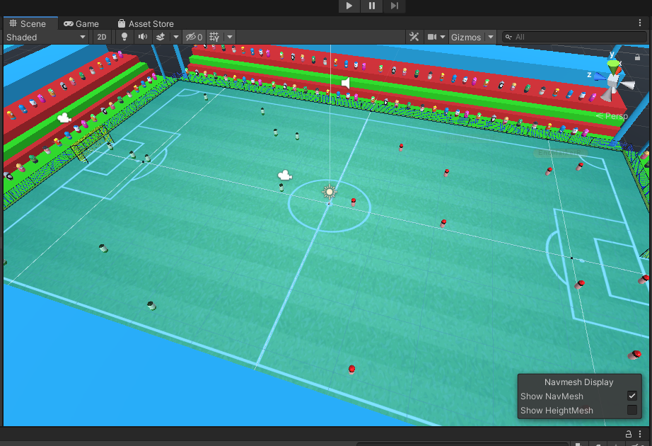
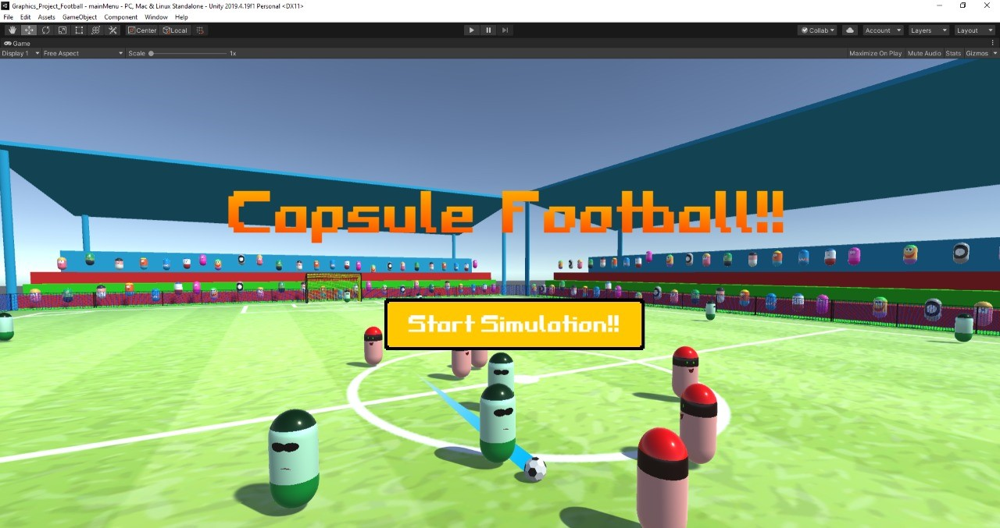
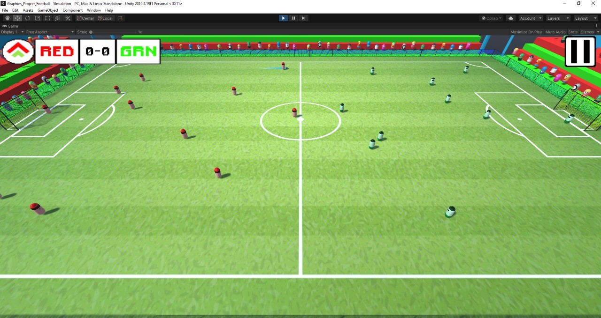
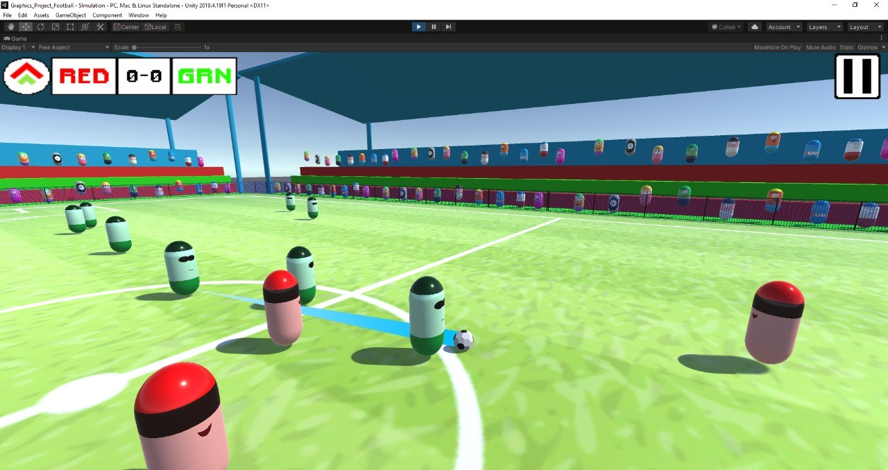
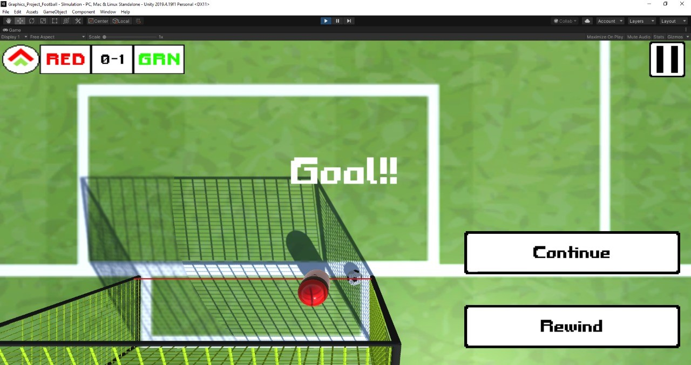
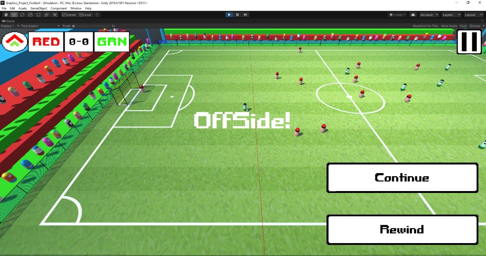

# Simulation_Football
For the project, I used Unity 3D to develop the models and simulate the required scenarios. Unity is a cross-platform game engine used to make real-time 3D projects for Games, Animations, etc.
 
I designed the 3D models like the football field, players and ball on Blender. Blender is an open-source 3D computer graphics software toolset used for creating visual effects, art, 3D models, motion graphics, etc. We have used simple materials to build our models with solid colors. 
 
To simulate the movement of each player on the football ground, I used Navigation Mesh Component (NavMesh). It is an abstract data structure used in AI applications to aid objects in pathfinding through complicated spaces. This would be helpful to simulate an auto played game, in which we can simulate our scenarios.
 

**Results-**
The results of the simulation are as follows. First is the Landing screen, with an option to begin the simulation. This simulation shows two teams in a football match, with options to create a scenario where there is uncertainty regarding a scored goal or a foul. In our simulation, we would be able to rewind the game, and view the same scenario with better camera angles to determine what really happened.
 
To start the simulation, we have to simply click Start Simulation button.
 

 
After starting the simulation, a game between 2 teams starts, where players can be observed passing and tackling to gain control over the ball. Multiple camera angles are available to observe, like first person view.
 

 

  
When a goal is assumed to be scored, the game pauses. One can rewind the situation, and replay it frame by frame. Here, one can see a top camera angle which observes the goal line. The goal line blinks red if the ball has supposedly crossed the line completely. This indicates that if the goal has been scored, or it was saved successfully. This process removes any occurrence of doubt in play. This would result in a fair game for both the teams by accurately evaluating the possibility of a goal.
 

 

 
The second part of the simulation focuses on offside. “A player is in an offside position if: any part of the head, body or feet is in the opponents' half (excluding the halfway line) and any part of the head, body or feet is nearer to the opponents' goal line than both the ball and the second-last opponent.”
 
Assuming a normal game is being played as below:
 
 
 
In this case, we simulate a offside play.
 
 
 
 
To check the presence of offside, the simulation tracks the accurate positions of all the players, and in case of an offside situation, one can view the play again, and an accurate offside line will be drawn to check if the player was offside or not.

